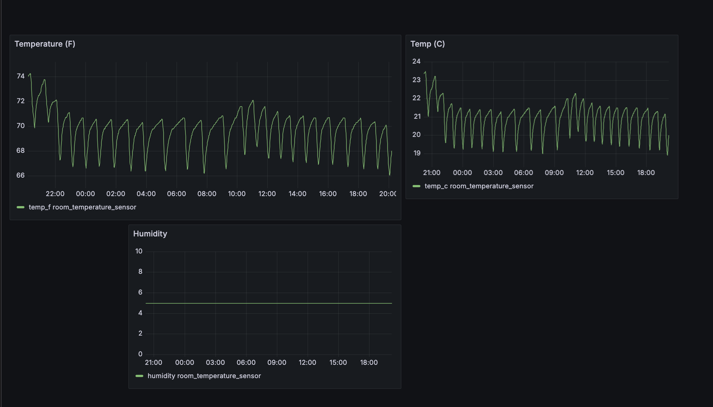

# Real-Time Temperature Visualization

This project combines Arduino, Kafka, and Grafana to provide live visualization of temmperature data. 

A docker environement, deployed on a Linux server, runs a Kafka network. 

A python script reads serial data provided by an Arduino Nano and a DHC sensor. The script acts as a kafka 
producer. 

A kafka consumer writes these serial updates to an InfluxDB, which is fed into Grafana. 

The Graphana dashboard is configured for high availability. 

## Graphana Dashboard

This screenshot shows the temperature in my lving room over a 24 hour 
cycle. 

### To Do
- [ ] implement fast and slow storage model

